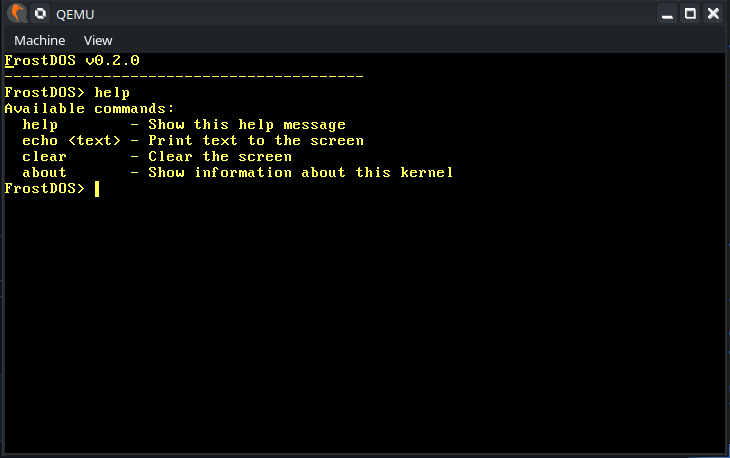

# FrostDOS

## A OS (more of a kernel) coded entirely in Rust

## Features
* Basic Shell
* Heap Allocation
* Keyboard Input

## Commands
* echo - Echos back your Message
* about - Kernel info
* clear - Clear the screen
* help - Show the help message
* reboot - Reboots the system

## Credits
Philipp Oppermann for his 'Writing an OS in Rust' guide
